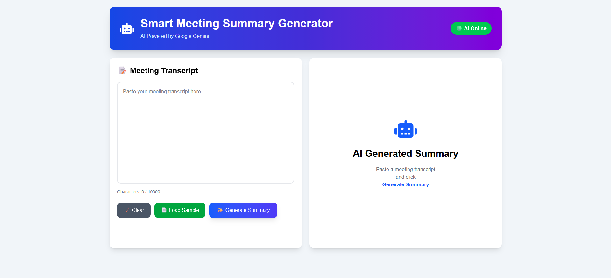
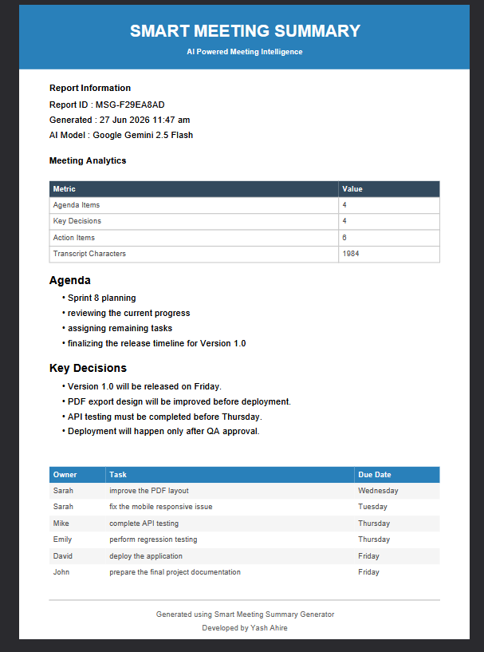
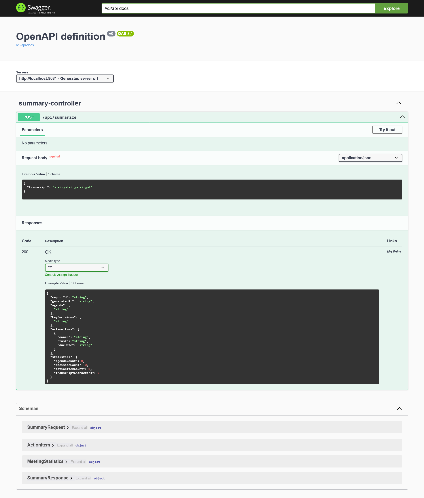

# 🤖 Smart Meeting Summary Generator


An AI-powered full-stack web application that converts raw meeting transcripts into structured meeting summaries using **Google Gemini 2.5 Flash**.

The application intelligently extracts:

* 📋 Agenda
* 🎯 Key Decisions
* ✅ Action Items (Owner & Due Date)
* 📊 Meeting Analytics

and generates a professional PDF report with a modern responsive dashboard.

---

# ✨ Key Highlights

* 🤖 Google Gemini 2.5 Flash Integration
* ⚡ Spring Boot REST API
* ⚛ React + Vite Frontend
* 🎨 Tailwind CSS UI
* 📄 Professional PDF Export
* 📊 Meeting Analytics Dashboard
* 📋 Copy Summary
* 🔔 Toast Notifications
* 📖 Swagger API Documentation
* 📱 Fully Responsive Design
* 🛡 Hallucination Management

---

# 🛠 Tech Stack

## Backend

* Java 17
* Spring Boot 3.5
* Spring Web (RestTemplate)
* Maven
* Google Gemini 2.5 Flash API
* Jackson
* Lombok
* Swagger OpenAPI
* SLF4J Logging

## Frontend

* React
* Vite
* Tailwind CSS
* Axios
* React Hot Toast
* jsPDF
* jspdf-autotable
* React Icons

---

# 🤖 AI Model Selection & Technical Decisions

## Selected AI Model

**Google Gemini 2.5 Flash**

### Why Gemini 2.5 Flash?

The application uses **Google Gemini 2.5 Flash** because it provides an excellent balance of speed, accuracy, and cost for real-time meeting summarization.

### Reasons for Selection

* ⚡ Fast response time suitable for interactive applications.
* 🧠 Excellent understanding of long meeting transcripts.
* 🎯 High-quality extraction of agendas, decisions, and action items.
* 💰 Cost-efficient compared to larger reasoning models.
* 🔗 Easy REST API integration with Spring Boot.
* 📈 Modular architecture allows replacing Gemini with another LLM in the future with minimal changes.

### Hallucination Management

To reduce hallucinations and improve reliability:

* The prompt instructs the model to extract **only explicitly mentioned information**.
* If an owner is unavailable, it returns **"Not specified"**.
* If a due date is unavailable, it returns **"Not specified"**.
* The AI is instructed to return **strict JSON only**, ensuring consistent parsing and reducing formatting errors.

---

# 🏗 System Architecture

```text
React Frontend
        │
        ▼
Spring Boot REST API
        │
        ▼
Google Gemini 2.5 Flash API
        │
        ▼
AI Generated Structured JSON
        │
        ▼
Meeting Summary Dashboard
        │
        ├────────► PDF Export
        │
        ├────────► Copy Summary
        │
        └────────► Meeting Analytics
```

---

# 📂 Project Structure

```text
Entrata
│
├── frontend
├── summary-meeting
├── Screenshots
├── README.md
└── .gitignore
```

---

# 📷 Application Screenshots

## 🏠 Home Page



---

## 📋 AI Generated Summary & Analytics


---

## 📄 Professional PDF Report



---

## 📖 Swagger Documentation



---

# 🚀 Getting Started

## Clone Repository

```bash
git clone https://github.com/Yash-Ahire-2004/smart-meeting-summary-generator.git
```

## Backend

```bash
cd summary-meeting
mvn spring-boot:run
```

Backend runs on:

```
http://localhost:8081
```

## Frontend

```bash
cd frontend
npm install
npm run dev
```

Frontend runs on:

```
http://localhost:5173
```

---

# ⚙ Configuration

Create:

```
src/main/resources/application-local.properties
```

Add your Gemini API key:

```properties
gemini.api.key=YOUR_GEMINI_API_KEY
```

Enable the local profile:

```properties
spring.profiles.active=local
```

---

# 📡 REST API

### Generate Meeting Summary

**POST**

```
/api/summarize
```

### Sample Request

```json
{
  "transcript": "Paste your meeting transcript here..."
}
```

### Output

The API returns:

* Report ID
* Generated Timestamp
* Agenda
* Key Decisions
* Action Items
* Meeting Statistics

---

# 📄 PDF Report Includes

* Report ID
* Generated Timestamp
* Meeting Analytics
* Agenda
* Key Decisions
* Action Items
* AI Generated Summary

---

# 🌟 Future Enhancements

* User Authentication
* Database Integration
* Meeting History
* Email Summary
* Calendar Integration
* Voice-to-Text Support
* Multi-language Support
* Retrieval-Augmented Generation (RAG) using previous meeting history
* Editable summary regeneration (Agenda, Decisions, or Action Items)

---

# 👨‍💻 Developer

## Yash Ahire

Java Full Stack Developer

### Skills

* Java
* Spring Boot
* REST APIs
* React
* Tailwind CSS
* Google Gemini AI

GitHub:

https://github.com/Yash-Ahire-2004

---

# 🙏 Acknowledgements

* Google Gemini AI
* Spring Boot
* React
* Tailwind CSS
* Swagger OpenAPI
* jsPDF
* Vite

---

# 📜 License

Developed as part of the **Entrata AI Assignment**.

---

## ⭐ If you found this project useful, please consider giving it a Star on GitHub!
